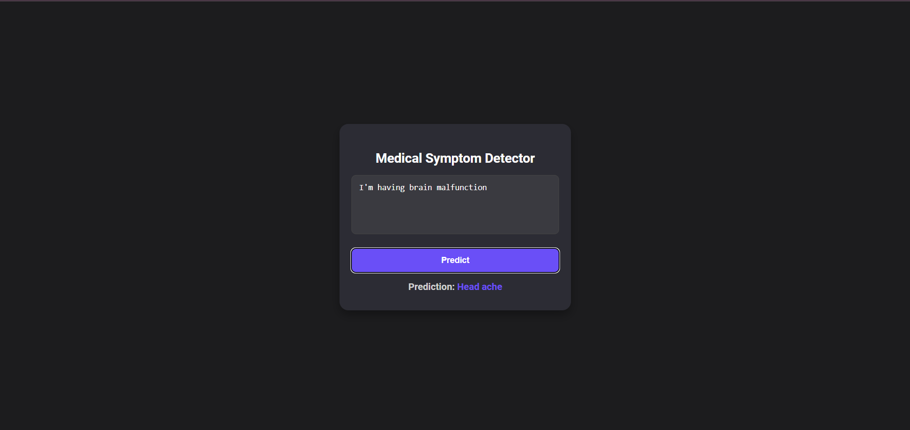

# Medical Symptom Detector

A web-based application built using **Flask**, **PyTorch**, and **Transformers** to detect medical symptoms based on user input. This tool can be used for basic intent detection in medical applications like chatbots.

---

## **Features**

- **BERT Model**: Utilizes a pre-trained BERT model for symptom classification.
- **Flask API**: Backend developed with Flask for seamless data processing and model inference.
- **Interactive Web Interface**: Users can enter symptoms via a user-friendly web interface to get predictions.
- **Responsive Design**: A clean, responsive interface styled with CSS.
- **JSON API Endpoint**: Allows integration with other tools through the `/predict` endpoint.

---

## **Project Structure**

```
project-folder/
├── app.py                # Flask backend application
├── static/
│   └── style.css         # Custom CSS for frontend styling
├── templates/
│   └── index.html        # HTML template for the web interface
├── saved_model/          # Saved BERT model and label data
│   ├── config.json
│   ├── pytorch_model.bin
│   ├── tokenizer_config.json
│   ├── vocab.txt
│   ├── df_label.pkl
└── README.md             # Project documentation
```

---

## **Setup and Installation**

### **Prerequisites**

- Python 3.8 or above
- pip (Python package manager)
- A virtual environment (optional but recommended)

### **Steps**

1. **Clone the Repository**
   ```bash
   git clone https://github.com/your-username/medical-symptom-detector.git
   cd medical-symptom-detector
   ```

2. **Set Up a Virtual Environment**
   ```bash
   python -m venv env
   source env/bin/activate        # For macOS/Linux
   .\env\Scripts\activate         # For Windows
   ```

3. **Install Dependencies**
   ```bash
   pip install -r requirements.txt
   ```

4. **Run the Application**
   ```bash
   python app.py
   ```

5. **Open the Application**
   - Go to `http://127.0.0.1:5000` in your browser.

---

## **Usage**

### **Web Interface**

- Open the web app in your browser.
- Enter your symptoms in the text area.
- Click the **Predict** button to view the prediction.

---

## **Customization**

### **Frontend**
- Modify the styles in `static/style.css` for design changes.
- Update `templates/index.html` to add or remove elements.

### **Model**
- Replace the saved model in the `saved_model/` directory with a new one trained on custom data.

---

## **Screenshots**

### **Web Interface**



---

## **Contributing**

1. Fork the repository.
2. Create a new branch: `git checkout -b feature-branch-name`.
3. Commit your changes: `git commit -m 'Add some feature'`.
4. Push to the branch: `git push origin feature-branch-name`.
5. Open a pull request.

---

## **License**

This project is licensed under the MIT License. See the `LICENSE` file for details.


